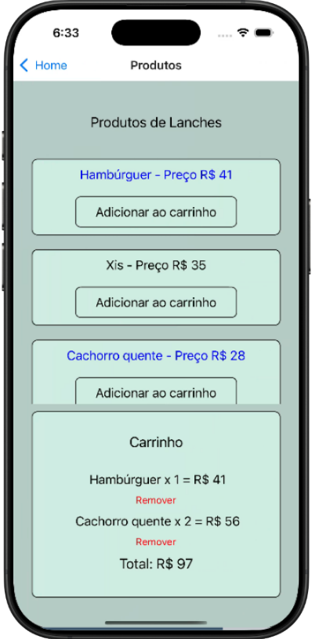

# Infnet Food

Este é um projeto desenvolvido no semestre de Desenvolvimento Front-end da faculdade Infnet, utilizando React Native.  
O app simula um sistema de pedidos de comida com gerenciamento de carrinho, checkout e mapa de restaurantes.

## Funcionalidades

* Página de Login (qualquer combinação de e-mail e senha desbloqueiam o acesso) 
* Página Home (contém uma lista de categorias e botão de configuração), ao selecionar uma categoria o usuário é encaminhado a tela de Produtos da categoria selecionada, podendo adicionar ou remover itens do carrinho. 
* Tela de perfil contendo o nome e email do usuário logado.
* Tela de pedido, contendo os pedidos realizados pelo usuário. 
* Mapa, contendo 10 restaurantes da região Central do Rio de Janeiro. Ao clicar no restaurante o usuário é direcionado a uma página contendo o nome do restaurante, endereço e um exemplo de item do cardárpio do mesmo.
* Checkout, contendo os pedidos realizados com campo de endereço de entrega e método de pagamento a serem preenchidos para ser possível a confirmação do pedido.

[Link do app no Snack Expo Dev](https://snack.expo.dev/@thiagonogueira/infnetfood)

## Screenshots (Tema Claro)

    <table>
        <tr>
            <td>
                
            </td>
            <td>
                
            </td>
            <td>
                
            </td>
        </tr>
        <tr>
            <td>
                
            </td>
            <td>
                
            </td>
            <td>
                
            </td>
        </tr>
        <tr>
            <td>
                
            </td>
            <td>
                
            </td>
            <td>
                
            </td>
        </tr>
    </table>

## Screenshots (Tema Escuro)

    <table>
        <tr>
            <td>
                
            </td>
            <td>
                
            </td>
            <td>
                
            </td>
        </tr>
        <tr>
            <td>
                
            </td>
            <td>
                
            </td>
            <td>
                
            </td>
        </tr>
        <tr>
            <td>
                
            </td>
            <td>
                
            </td>
            <td>
                
            </td>
        </tr>
    </table>

